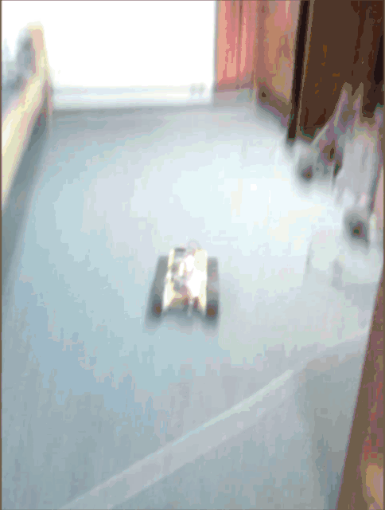
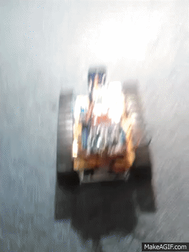
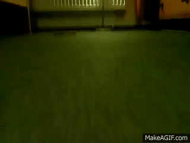
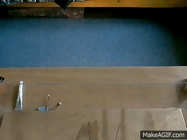
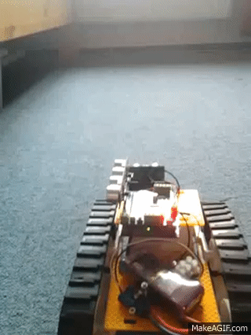
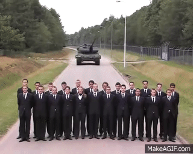
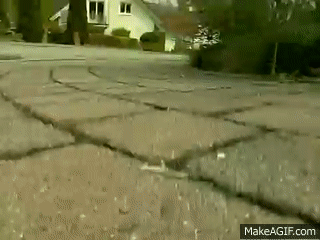
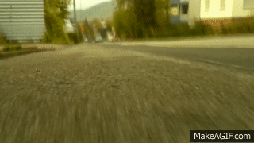

# caterpillar-robot

## old platform

[Smartphone video](https://forum.arduino.cc/index.php?topic=462107.msg3236016#msg3236016) of 587g robot backward roll 10cm above ground, slowed down 4×:   

[Smartphone video](https://forum.arduino.cc/index.php?topic=462107.msg3236016#msg3236016) of full speed (2.4m/s or 8.6km/h) U-turn in <0.5s:   

[Raspberry v1 camera](https://forum.arduino.cc/index.php?topic=462107.msg3236016#msg3236016) front view of full speed U-turn, played 3.6× slower than real at 25fps:   

[Raspberry v1 camera 90fps slowmo](https://forum.arduino.cc/index.php?topic=462107.msg3221028#msg3221028) of full speed U-turn from above, played 3.6× slower than real at 25fps:   

[Smartphone video](https://forum.arduino.cc/index.php?topic=462107.msg3214673#msg3214673) of back wheelie:   

[Video](https://forum.arduino.cc/index.php?topic=462107.msg3214673#msg3214673) shows that real tanks can do back wheelie as well:   

[Raspberry v1 camera](https://forum.arduino.cc/index.php?topic=462107.msg3482895#msg3482895) front view:  
  
  

[Raspberry v1 camera](https://forum.arduino.cc/index.php?topic=462107.msg3239076#msg3239076) joystick conrolled robot outdoor front view:  
  
  

