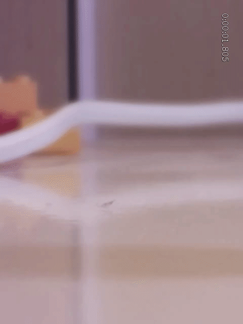
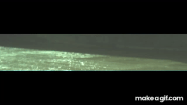

# coins

[raspivid 640x480@200fps with gstreamer timeoverlay+rotation](https://www.raspberrypi.org/forums/viewtopic.php?f=43&t=206047#p1293730)  

raspiraw 640x128@660fps video from   
[blog.robertelder.org/recording-660-fps-on-raspberry-pi-camera/](blog.robertelder.org/recording-660-fps-on-raspberry-pi-camera/)  

