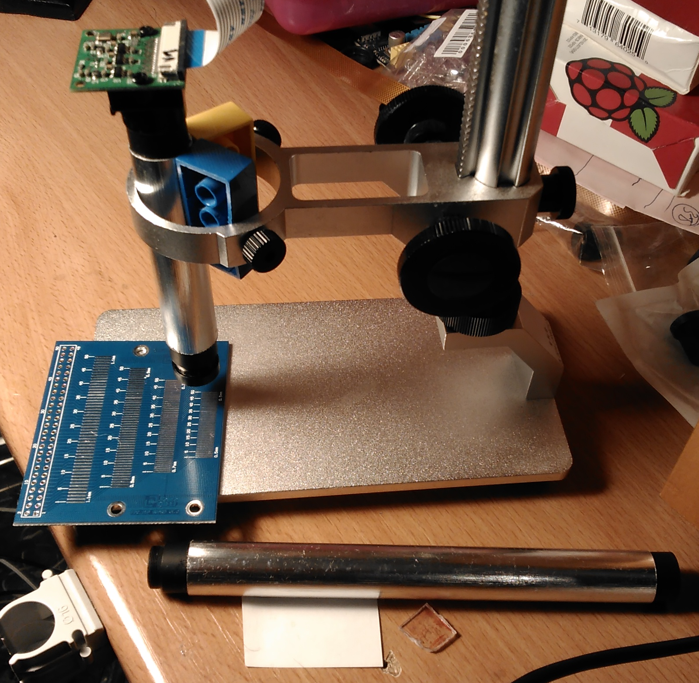
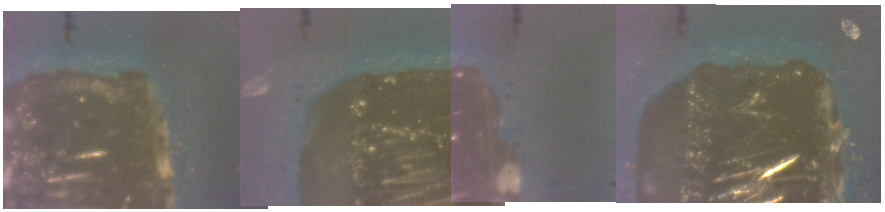
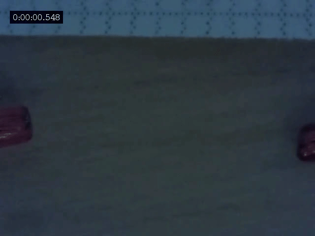
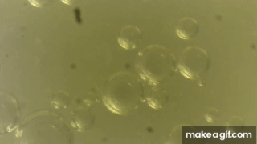

# microscope

Creating a Raspberry camera microscope with aluminum alloy holder and aluminum tube:  
https://www.raspberrypi.org/forums/viewtopic.php?t=210605&start=50#p1409956  

4 overlapping 5MP photos copied into one 8656x2080 pixel photo for measuring.  
v1 camera resolution is 0.153&micro;m/px, the contacts are 0.5mm spaced, you see roughly 1mm:  
https://www.raspberrypi.org/forums/viewtopic.php?t=210605&start=50#p1409956  

From v2 camera video, 800KV spark at "only" 16&micro;m/pixel resolution, but at 180fps framerate for 640x480:  
https://www.raspberrypi.org/forums/viewtopic.php?f=43&t=210605#p1300911  

Air bubbles moving really slow (at 0.347&micro;m/s speed!) in spittle, 0.7&micro;m/px, played 25&times; faster:  
https://www.raspberrypi.org/forums/viewtopic.php?t=210605&start=50#p1409065  

