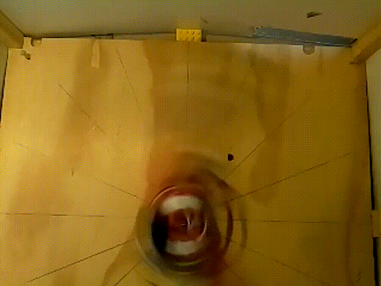

# motor-test-station

[peephole](https://www.raspberrypi.org/forums/viewtopic.php?f=43&t=212518&p=1310445#p1316809) setup for high speed bump analysis:   

640x480@90fps video slowed down by factor of 10:   

[640x480@90fps video](https://www.raspberrypi.org/forums/viewtopic.php?f=43&t=212518&p=1310445#p1316809) from top, showing outrunner motor wheel loss at 52km/h:   

