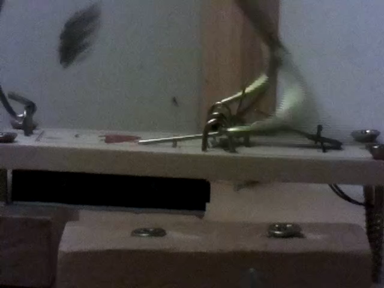
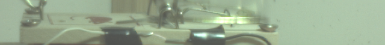
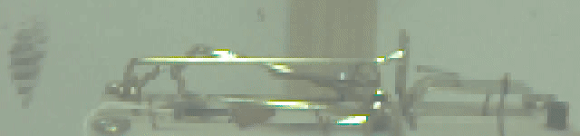
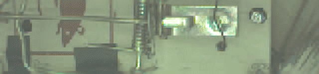
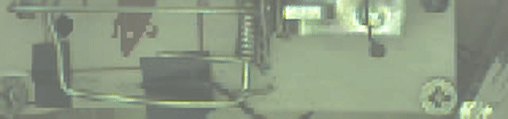

# mousetrap

[640x240_s tool at 360fps v1 video](https://www.raspberrypi.org/forums/viewtopic.php?f=43&t=201568&p=1254568&hilit=mouse+trap+chain+reaction#p1254427) of classical mousetrap (played 14.4&times; slowed down):

[640x128@350fps v1 video](https://www.raspberrypi.org/forums/viewtopic.php?f=43&t=201568&p=1254568&hilit=mouse+trap+chain+reaction#p1254568) of mousetrap chain reaction (played 14&times; slowed down):

[Extreme rolling shutter effect](https://www.raspberrypi.org/forums/viewtopic.php?f=43&t=201568&p=1254568&hilit=mouse+trap+chain+reaction#p1299347) of closing mousetrap bar:

[640x75@1007fps v2 video](https://www.raspberrypi.org/forums/viewtopic.php?f=43&t=212518&p=1310445#p1310445) of classical mousetrap closing in one-hundredth of a second:

10th frame of mousetrap bar closing phase:  
Bar hits black piezo igniter which creates a spark between cables at front of mousetrap:

[640x150_s tool 1007fps video](https://www.raspberrypi.org/forums/viewtopic.php?f=43&t=212518&p=1310445#p1313501) of classical mousetrap closing:

[640x150_s tool 1007fps video](https://www.raspberrypi.org/forums/viewtopic.php?f=43&t=212518&p=1310445#p1431771) from top with 150&micro;s shutter time, lit by focussed 5000lm led:

[640x150_s tool 1007fps video](https://www.raspberrypi.org/forums/viewtopic.php?f=43&t=212518&p=1314765&hilit=hermannsw+1000fps#p1433278) from top with 12&micro;s(!) shutter time, focussed lit by two 5000lm leds.  
Because of the very short shutter time video is very clear:

