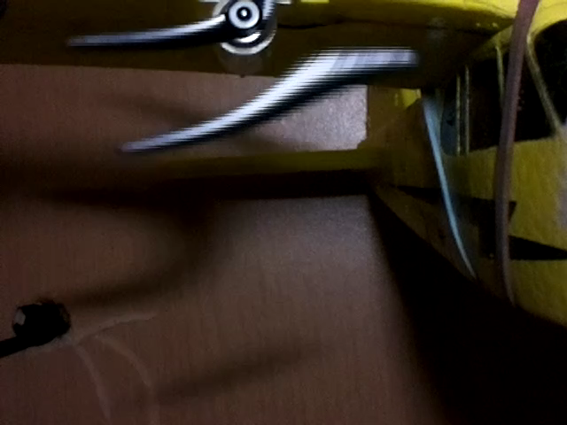

# propeller

Extreme rolling shutter effect in [640x480@180fps video, 200&micro;s shutter time, lit by 5000lm led](https://www.raspberrypi.org/forums/viewtopic.php?f=43&t=190407&p=1319617#p1319617)  

20140rpm propeller, 640x75@1007fps v2 video:  

20140rpm propeller, 640x150_s tool at 1007fps v2 video:  

Extreme rolling shutter effect in [26000rpm propeller smartphone video](https://github.com/Hermann-SW/Raspberry_v1_camera_global_external_shutter#introduction)  

[v1 camera global external shutter video](https://github.com/Hermann-SW/Raspberry_v1_camera_global_external_shutter#introduction) of 26000rpm propeller, 2MP scaled down to 640x360  
(scene lit by 5000lm led with 36µs strobe pulse duration):  

[2MP v1 camera global external shutter multiple exposure video frame](https://github.com/Hermann-SW/Raspberry_v1_camera_global_external_shutter#multiple-exposure),  
nine 9&micro;s duration flashes, 116&micro;s apart, 8000eps (exposures per second):

